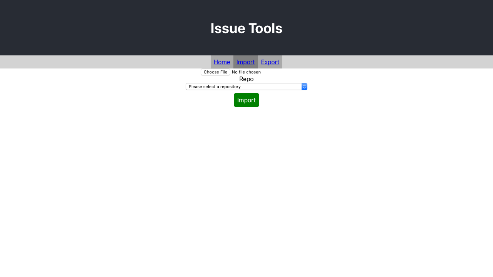

# github-issue-tools

[](https://circleci.com/gh/Coteh/github-issue-tools)
[](https://app.netlify.com/sites/issue-tools/deploys)

A web app to more efficiently work with GitHub Issues. Allows for import and export of issues from/to a CSV file.

**UI is still being worked on**



## Features

- Import issues from CSV
  - Title and description can be mapped from CSV columns using the interface.
  - State also supported: If issue is closed in CSV, it'll be closed on GitHub too.
- Export issues to CSV
  - Just title, state, and description are supported at the moment.
- GitHub OAuth support

## Installation

### Environment Variables

#### Frontend

Create `.env.local` file in project root:

```
REACT_APP_AUTH_SERVER_URL=<url to auth server>
```

#### Backend Auth

Create `.env` file in `auth-grant` subdirectory:

```
NODE_ENV=<production or development>
GITHUB_CLIENT_ID=<client id from GitHub>
GITHUB_CLIENT_SECRET=<client secret from GitHub>
REDIRECT_URI=<URI to redirect users back to after granting access>
PORT=<port to run server on, 8080 if deploying to App Engine>
SESSION_SECRET=<secret for express-session>
REDIS_URL=<URL for Redis session server (production only)>
```

## Local Installation

### Frontend

1. `yarn install`
1. `yarn start`

### Backend Auth Grant Server

1. `cd auth-grant`
1. `npm install`
1. `npm start`

## Deploy

### Frontend Deployment

1. `yarn build`
1. Host server or host on JAMstack deployment service such as Netlify

### Auth Grant Server to App Engine

(assuming you have project setup and `gcloud` installed with it pointing to project)

1. `cd auth-grant`
1. `gcloud app deploy app.yaml`
